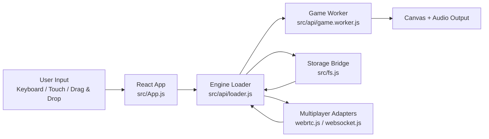

# DiabloWeb Architecture Overview (Phase 0)

This document defines the Phase 0 architecture baseline for the current runtime.

## Scope

Phase 0 baseline docs cover these required surfaces:

- App boot path (`src/index.js` -> `src/App.js`)
- Worker lifecycle and teardown expectations (`src/api/loader.js`, `src/api/game.worker.js`)
- Render loop and output flow
- Storage interaction path (`src/fs.js`)
- Multiplayer handshake boundaries (`src/api/webrtc.js`, `src/api/websocket.js`)

Companion sequence/state diagrams live in `docs/system-diagrams.md`.

## Runtime Topology

## Baseline Boundaries and Responsibilities

### 1) App Shell and Input Boundary

`src/App.js` currently owns UI rendering and also coordinates input/session/file flows. During modernization, this should become a composition shell while extracted modules own behavior.

### 2) Loader Orchestration Boundary

`src/api/loader.js` coordinates worker startup, render/audio wiring, fs bridging, and multiplayer transport events. It is the primary runtime orchestration hotspot.

### 3) Worker and Render Boundary

`src/api/game.worker.js` drives game execution; the loader bridges worker events to render/audio sinks. Message contracts are currently implicit and should be formalized in a later phase.

### 4) Storage Boundary

`src/fs.js` provides persistence helpers used by runtime flows. The baseline assumption is that storage operations must remain deterministic across import/export/list/delete/clear interactions.

### 5) Multiplayer Boundary

`src/api/webrtc.js` and `src/api/websocket.js` provide transport-level connectivity. Session join/reject/disconnect behavior should remain unchanged while abstractions are introduced.

## Immediate Phase 0 Follow-ups

- Keep diagrams in sync with observed runtime behavior.
- Add ADRs for any architecture decision that changes ownership or contracts.
- Use this baseline for regression-focused refactors in Phases 1-4.
