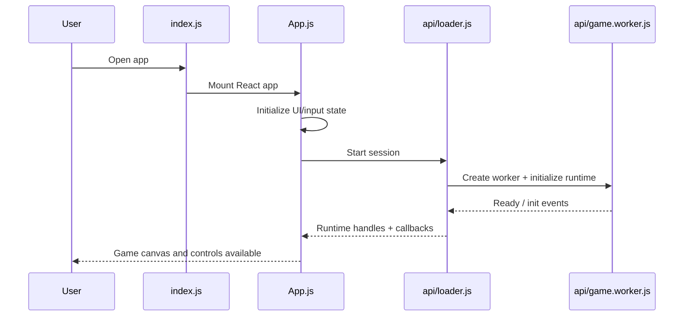
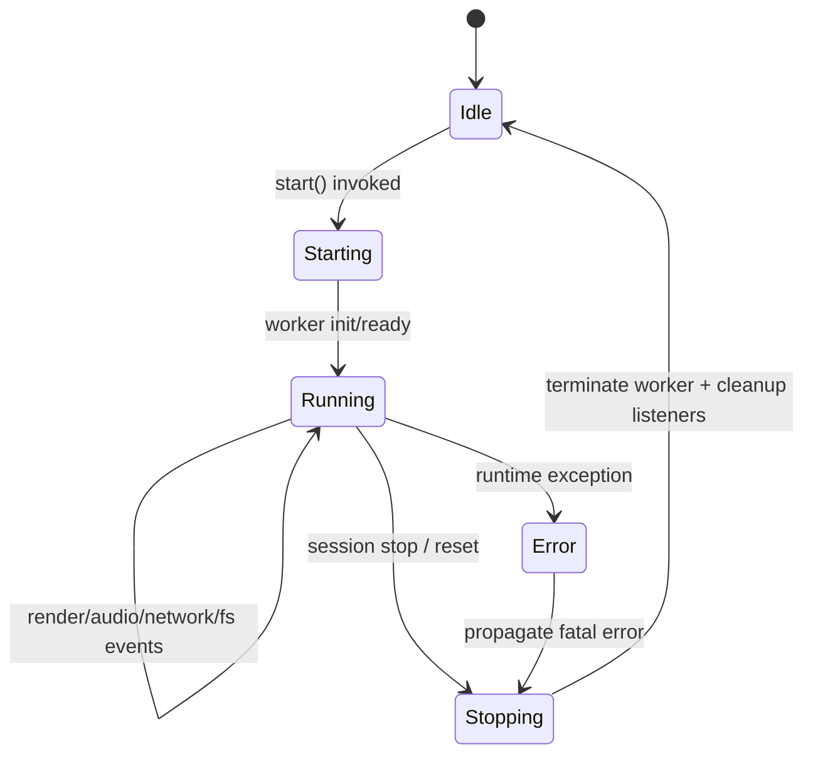
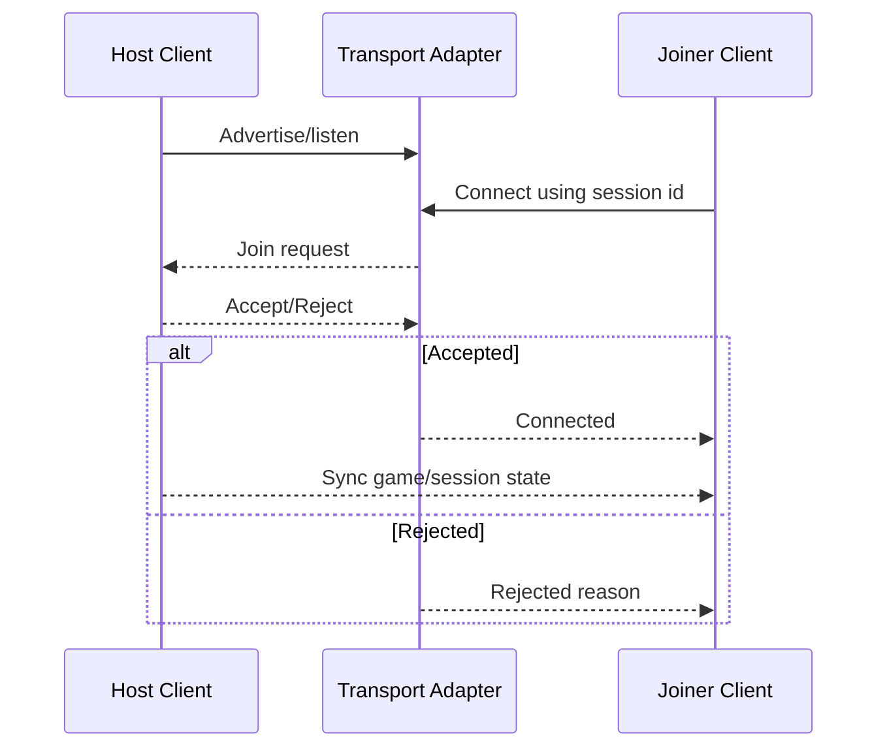
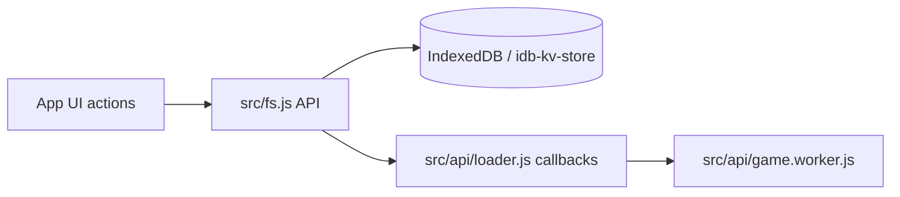

# DiabloWeb System Diagrams (Phase 0)

These diagrams expand the Phase 0 baseline with concrete flows for boot, worker lifecycle, and multiplayer handshake.

## App Boot and Engine Startup

## Worker Lifecycle Contract (Current Behavior)

## Multiplayer Join Handshake (Abstracted)

## Storage Interaction Path

